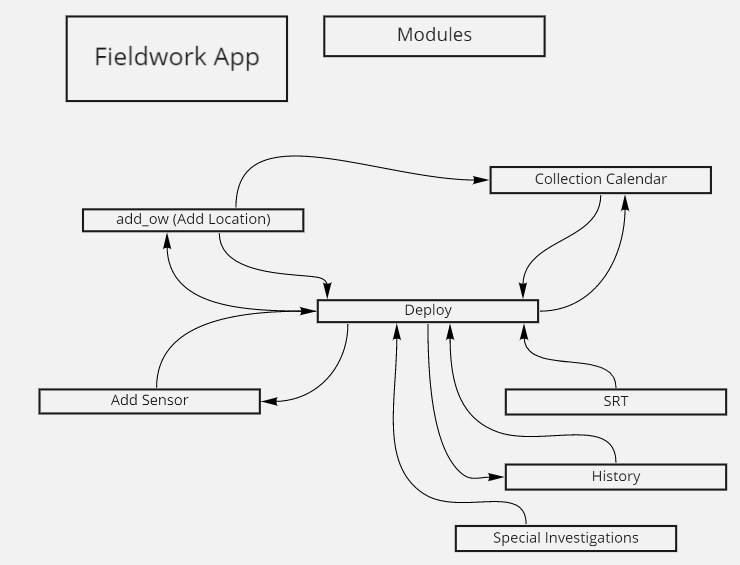
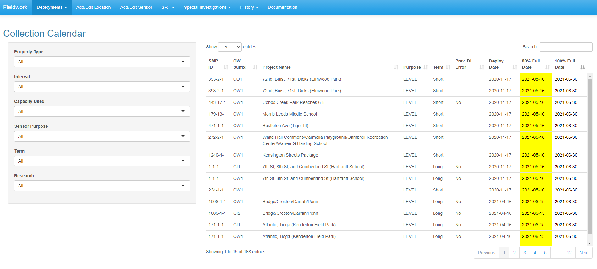

```{r setup, include=FALSE}
knitr::opts_chunk$set(echo = TRUE)

```


## Modules of the Fieldwork App

Each module contains a UI and a Server function. These functions are used in the app's main source file, app.R. In app.R, settings are created, database connections are set, and universal variables are queried (for example, the app.R server function maintains a global list of SMP IDs available to every module). Then, the files that contain modules are sourced, app.R's UI and server functions are instantiated, and a `runApp` function is called. The UI and server functions from the modules are called within app.R's global UI and server functions; the module functions' arguments include the aforementioned universal variables, database connection, and other modules' return values. 

The Fieldwork App's modules all pass or receive information from at least one other module. These interactions are shown in the web below; for example, the Special Investigations module sends information to the Deploy Sensor module, but does not receive information from any other modules. While the "Deploy" module is the Fieldwork App's visual hub, the "Collection Calendar" module is the landing page. Routine interactions with the app often start in Collection Calendar and go elsewhere.



Collection Calendar contains a table view with relevant info for the fieldwork team. Clicking a row in this table view sends the user to Deploy, with the deployment info from that row pre-populated in the Deploy UI. There are several steps that happen within Collection Calendar's server function to get there, and some that happen in Deploy's server function. We will examine these steps one at a time.

### Step 1: Collection Calendar UI - Create selectable output object

Collection Calendar's UI function is shown below. TabPanels are in a list so that they can be worked with more easily in app.R. The sidebarPanel separates the input controls from the mainPanel's datatable. The `DTOutput` function creates a reactive output variable, here named `collection`. It also creates an input variable, by default named `tableID`_rows_selected (e.g., `collection_rows_selected` here).


```{r collection_UI, eval = FALSE}

collection_calendarUI <- function(id, label = "collection_calendar"){
  ns <- NS(id)
  useShinyjs()
  
  #create a tabPanel for each tab
  list(
    tabPanel("Collection Calendar", value = "calendar_tab", 
             titlePanel("Collection Calendar"), 
             useShinyjs(), #this needs to be called anywhere in the UI to use other Shinyjs() functions
             sidebarPanel(
               selectInput(ns("property_type"), "Property Type", 
                           choices = c("All" = .5, "Public" = 1, "Private" = 0)),
               ... #Several more selectInputs elided for brevity
             ), 
             mainPanel(
               DTOutput(ns("collection"))
             )
    ), 
    tabPanel("Future Deployments", value = "future_tab", 
             
             titlePanel("Future Deployments"), 
                reactableOutput(ns("future")), 
             downloadButton(ns("download_future"), "Download Future Deployments")
    )
  )
  
}

```



### Step 2: Collection Calendar Server - Configure selectable output object

Next, in Collection Calendar's server function, a table is queried, then modified to contain desired fields and rows based on the sidebar filters. This table forms the basis of the table view shown in Collection Calendar's right hand side.

Throughout the app, tables are queried and stored in variables with the suffix "_db". This version is stored alongside a "clean" version, that has fields renamed for display in the app UI. Both table objects are reactive variables. The clean, displayable, version lacks a suffix and reacts based on the "_db" version.  In Collection Calendar, the table as-queried from the DB is stored in `rv$collect_table_db`. The clean version is stored in `rv$collect_table`. 

The latter is assigned to the datatable output object `output$collection` with the argument `selection = "single"`. This allows the user to select one row at a time in the output object; when the user does, the numeric index of the selected row is assigned to the reactive value `input$collection_rows_selected`.

```{r collection_server, eval=FALSE}

#query the collection calendar and arrange by deployment_uid
collect_query <- "select * from fieldwork.active_deployments"
rv$collect_table_db<- odbc::dbGetQuery(poolConn, collect_query)

...#content filtering elided for brevity 

#select and rename columns to show in app
rv$collect_table <- reactive(rv$collect_table_filter2() %>% 
                            dplyr::select(smp_id, ow_suffix, project_name, type, term, previous_download_error,
                                             deployment_dtime_est,date_80percent,date_100percent)  %>% 
                               rename("SMP ID" = "smp_id") ...)
                              #column renaming elided for brevity

output$collection <- renderDT(
        DT::datatable(
          rv$collect_table(), 
          selection = "single", 
          style = 'bootstrap', 
          class = 'table-responsive, table-hover', 
          options = list(scroller = TRUE, 
                         scrollX = TRUE, 
                         scrollY = 550, 
                         order = list(8, 'asc')), 
          rownames = FALSE) %>%
          formatStyle(
            '80% Full Date',
            backgroundColor = styleInterval(lubridate::today(), c('yellow', 'transparent')), 
            color = 'black'
          ) %>%
          ... #More functions to style table cells elided for brevity
      )

```

### Step 3: Collection Calendar Server - Observe selectable output object's corresponding input value

The next step, also within Collection Calendar's server function, is to observe `input$collection_rows_selected` for changes. When a row is selected, that value is updated. This performs two actions: 

1. Update a reactive value, `deploy_refresh`, that will instruct Deploy to update itself.
2. Change the user's current selected tab to Deploy.

Control flow in the server side of the Shiny app then returns to app.R. When it does, Collection Calendar returns a list of reactive values that will be passed into Deploy for the purposes of controlling Deploy when it refreshes. The list contains `deploy_refresh`, `input$collection_rows_selected`, and a variety of values from the selected row in `output$collection` [^1]

[^1]: For reasons not relevant to this example, these values are accessed through another reactive variable, `rv$collect_table_filter()`, but they are originally from the table contained in `output$collection`.


```{r collection_return, eval = FALSE}

      rv$deploy_refresh <- 0
      
      #this is a two-step observeEvent
      #when a line in the calendar is clicked, go toggle and update "smp_id_deploy", and switch tabs
      observeEvent(input$collection_rows_selected, {
        rv$deploy_refresh <- rv$deploy_refresh + 1
        updateTabsetPanel(session = parent_session, "inTabset", selected = "deploy_tab")
      })


      return(
        list(
          sensor_serial = reactive(rv$collect_table_db$sensor_serial),
          smp_id = reactive(rv$collect_table_filter()$smp_id[input$collection_rows_selected]),
          site_name = reactive(rv$collect_table_filter()$site_name[input$collection_rows_selected]),
          deploy_refresh = reactive(rv$deploy_refresh),
          rows_selected = reactive(input$collection_rows_selected),
          row = reactive(rv$collect_table_filter()$deployment_uid[input$collection_rows_selected]), 
          future_smp_id = reactive(rv$future_table_db$smp_id[input$fd_selected]), 
          future_site_name = reactive(rv$future_table_db$site_name[input$fd_selected]), 
          future_deploy_refresh = reactive(rv$future_deploy_refresh), 
          future_rows_selected = reactive(input$fd_selected), 
          future_row = reactive(rv$future_table_db$future_deployment_uid[input$fd_selected])
          )
        )

```

### Step 4: Global app.R Server - Pass Collection Calendar's output as input to Deploy

In app.R, you can see the server function calls for each module. Each server function is assigned to a variable. Modules that can send the user to other modules accept the variable of those other modules as an argument. For example, both Deploy and Add OW can send the user to Collection Calendar, so Collection Calendar accepts both `ow` and `deploy` as arguments. 

At the conclusion of the previous step, the return values from Collection Calendar are assigned to `collection_cal` in the global app.R server function. This value is then used as an input to `deployServer`, Deploy's server function. The values are assigned to the argument named `collect`. Therefore, in Deploy's server function, the outputs from Collection Calendar's server function can be referenced with `collect$foo`.

```{r eval = FALSE}

# 2.2: Server Module functions ---------------------------
    # Collection Calendar
    collection_cal <- collection_calendarServer("collection_calendar", parent_session = session,
                                 ow = ow, deploy = deploy, poolConn = poolConn)
    #Add Edit/Location
    ow <- add_owServer("add_ow", parent_session = session, smp_id = smp_id, poolConn = poolConn, deploy = deploy)
    #Add Edit/Sensor
    sensor <- add_sensorServer("add_sensor", parent_session = session, poolConn = poolConn,
                         sensor_status_lookup = sensor_status_lookup, deploy = deploy,
                         sensor_issue_lookup = sensor_issue_lookup)
    #Deploy Sensor
    deploy <- deployServer("deploy", parent_session = session, ow = ow, collect = collection_cal,
                         sensor = sensor, poolConn = poolConn, deployment_lookup = deployment_lookup,
                         srt = srt, si = special_investigations, cwl_history = cwl_history, smp_id = smp_id, 
                         sensor_issue_lookup = sensor_issue_lookup, newstyleEqual = newstyleEqual)
    #SRT
    srt <- SRTServer("srt", parent_session = session, poolConn = poolConn,
                     srt_types = srt_types, con_phase = con_phase, sys_id = sys_id, 
                     special_char_replace = special_char_replace)
    #Special Investigations
    special_investigations<- special_investigationsServer("special_investigations", parent_session = session,
                                        poolConn = poolConn, con_phase = con_phase, si_lookup = si_lookup,
                                        requested_by_lookup = requested_by_lookup, sys_id = sys_id, 
                                        special_char_replace = special_char_replace)
    #History
    cwl_history <- cwl_historyServer("history", parent_session = session, poolConn = poolConn, deploy = deploy)


```

### Step 5: Deploy Server - Checking reactive inputs and updating Deploy's input variables

Control flow then passes to Deploy's server function. Deploy is initiated with three tables based on active, future, and previous deployments. These tables are invisible until an SMP ID or Site Name is selected, at which point they populate with the deployments at that site. The active deployment table query, through its visual output, is shown in the chunk below. 

```{r eval = FALSE}

      #query for active deployments
      active_table_query <- reactive(if(nchar(input$smp_id) > 0){
        paste0(
        "SELECT * FROM fieldwork.active_deployments
            WHERE smp_id = ", rv$smp_id(), " ORDER BY deployment_dtime_est")
      }else{
        paste0(
          "SELECT * FROM fieldwork.active_deployments
            WHERE site_name = '", input$site_name, "' ORDER BY deployment_dtime_est")
      })
      
      #create table as a reactive value based on query
      rv$active_table_db <- reactive(odbc::dbGetQuery(poolConn, active_table_query())%>% 
                                       mutate(across("download_error", 
                                                 ~ case_when(. == 1 ~ "Yes", 
                                                                . == 0 ~ "No"))))
      
      #select columns to show in app, and rename
      rv$active_table <- reactive(rv$active_table_db() %>% ...)
      #visual modifications elided for brevity
      
      #render Datatable
      output$current_deployment <- renderDT(
        rv$active_table(),
        selection = "single",
        style = 'bootstrap', 
        class = 'table-responsive, table-condensed',
        options = list(dom = 'tp')
      )
      
```

The Deploy server function contains several `observeEvent` calls that check each of its module communication input variables (i.e. `collect` from Collection Calendar, `ow` from Add OW, etc) for the changes to the `deploy_refresh` value. If that value has changed, Deploy knows that the variable's source module was the one that passed control flow to Deploy, and, as such, has data for Deploy to read. Deploy reads this data and populates it into Deploy's input fields. The code block below contains Collection Calendar's corresponding `observeEvent`. 

Finally, it's time for Deploy to display the data. In Deploy, the SMP ID or Site Name is the foundational value. Tables and `selectInput` functions are based on the SMP ID or Site Name. They are first reset to purge any existing selections. Then, a value is selected from the `collect` list. The length check helps Deploy know whether the data it's reading has an SMP ID or Site Name as its foundation. This causes Deploy's corresponding datatable output object (not depicted here), to update based on the new foundational value. That is to say, now that Deploy knows which SMP/Site has been selected, it can populate its datatable (process shown above) with the deployments from that location.

Since that table update requires a filter operation, which takes time, a delay is used to allow that filter to complete before selecting a row in Deploy's datatable output. `collect$row` is the deployment_uid of the row selected in Collection Calendar, and that is used to select the row in Deploy's datatable. Selecting a row in the deployment datatable also pre-fills most sidebar fields for easy editing.

```{r eval = FALSE}

      #upon clicking a row in collection_calendar
      observeEvent(collect$deploy_refresh(), {
        updateSelectizeInput(session, "smp_id", selected = character(0))
        updateSelectInput(session, "site_name", selected = "")
        # need to get through the initial load where length == 0 for collection calendar smp_id 
          #(is.na does not work in that case)
        # go to either smp id or site name
        if(length(collect$smp_id()) > 0){
          if(!is.na(collect$smp_id())){
          updateSelectizeInput(session, "smp_id", choices = smp_id, selected = collect$smp_id(), server = TRUE)
          }else{
          updateSelectInput(session, "site_name", selected = collect$site_name())
          }
          #delay so that the selectizeInput is updated and table is queried before it is searched by R
          #this is where the above chunk reaction is happening
          delay(250,{
                  rv$active_row <- reactive(which(rv$active_table_db()$deployment_uid == collect$row(), 
                                                  arr.ind = TRUE))
                  dataTableProxy('current_deployment') %>% selectRows(rv$active_row())
                })
        }
      })
      
```

### Step 6: Deploy Server - Updating Input Selections Based on Selected Row

Selecting a row in the Active Deployments table indicates the need to either edit or access more information about that deployment. The future and previous deployments tables work similarly. Clicking a row in the collection calendar leads to this step, but users can also manually go to Deploy Sensor, select an SMP ID or Site Name, and select a row. 

When a row is selected, that row's position within the datatable is identified, which is used to reference the row's position and related attributes in the "_db" table. Additionally, rows in other tables are deselected. Since these row selections are referenced so much, a shorthand was created. Then, a reactive value is updated based on the selected row. When this reactive value changes, an `updateSelectInput` is triggered with an `observe`. 

```{r eval = FALSE}

#when a row in active deployments table is clicked
observeEvent(input$current_deployment_rows_selected, {
  #deselect from other tables
  dataTableProxy('prev_deployment') %>% selectRows(NULL)
  dataTableProxy('future_deployment') %>% selectRows(NULL)
})

#shorten name of selected rows from active and prev deployments tables
      rv$active <- reactive(input$current_deployment_rows_selected) 
      rv$prev   <- reactive(input$prev_deployment_rows_selected)
      rv$future <- reactive(input$future_deployment_rows_selected)
      
      #update sensor id 
      #find which table has a row selected 
      #then update reactive value definition based on that
      rv$sensor_id <- reactive(if(length(rv$active()) > 0){
        rv$active_table_db()$sensor_serial[rv$active()] 
      }else if(length(rv$prev()) > 0){
        rv$old_table_db()$sensor_serial[rv$prev()]
      }else if(length(rv$future()) > 0){
        rv$future_table_db()$sensor_serial[rv$future()]
      })
      
      ...#more updates elided for brevity
      
      #update inputs based on the reactive value definitions above
      observe({
        updateSelectInput(session, "sensor_id", selected = rv$sensor_id())
        ...# more updates elided for brevity
      })

```

